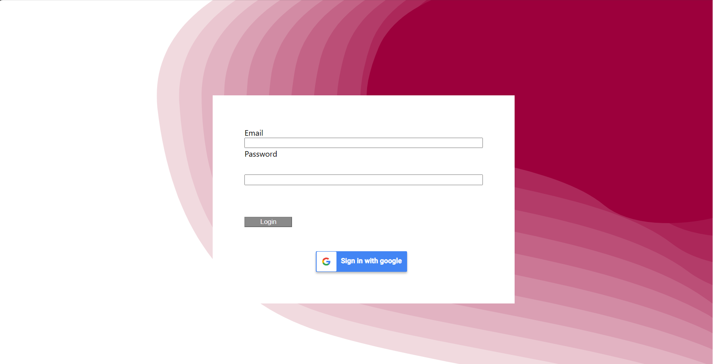
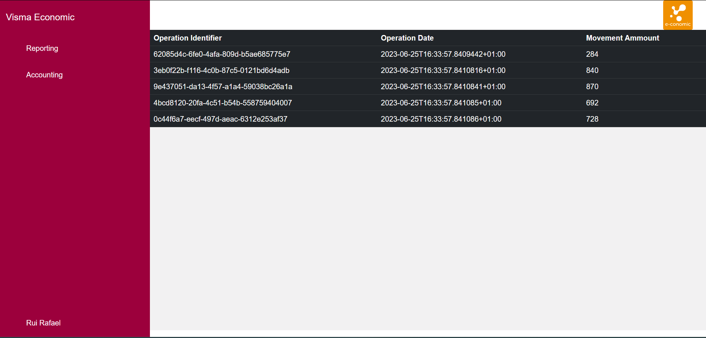
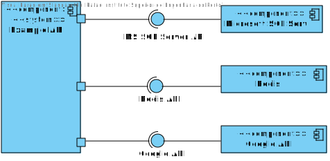
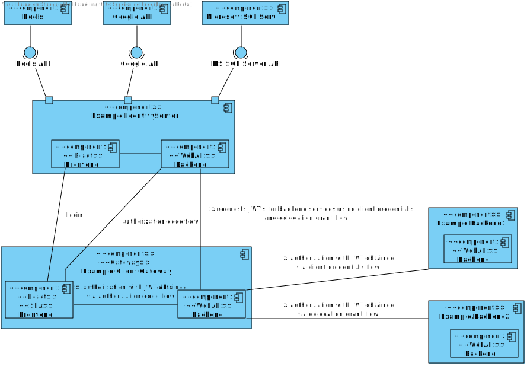
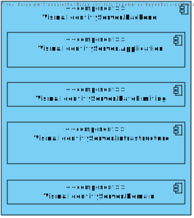

# VISMA.IAM
The goal with this solution was to not only develop something that adhered to the requirements in the challenge description but also to try and develop an IAM solution that would somewhat resemble the requirements for a distributed and complex system with different authentication and authorization needs. As such, the proposed solution contains the following functionalities:

- An SSO that can be used through out Economics.
- SSO integration with Google's external provider. Disclaimer: Upon the submission of this solution, it has not been possible to fully integrate with Google's API.
- Rate limiting to prevent brute force attacks on logins.
- Authorization code flow for login.
- Client credentials flow for accessing protected resources in a machine to machine communication scenario.
- Delegation grant flow for accessing protected resources in behalf of a user.
- Identity Server was developed using Domain Driven Design and Clean Architecture Principles.
- Unit tests for the Identity Server and it's components.
- A React SPA to show the different IAM flows and scenarios.

The SSO UI is a simple React application:

The React SPA to show the different IAM flows and scenarios has the following looks:

In the following sections there are 3 component diagrams that show the developed solution from 3 different levels.

The main project of this solution is located at src/IdentityServer/Visma.IdentityServer.

## Level 1

## Level 2

## Level 3
