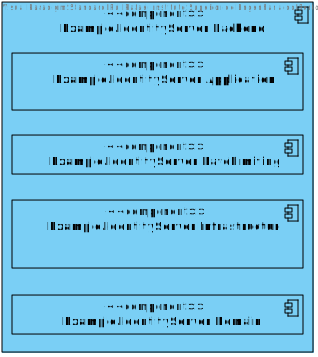

# Example.IAM
The goal with this solution was to develop an example of a custom identity server solution for IAM(Identity and Access Management) which  would somewhat resemble the requirements for a distributed and complex system with different authentication and authorization needs. As such, the example solution contains the following functionalities:

- An SSO that can be used through out Economics.
- SSO integration with Google's external provider. Disclaimer: this is still not yet implemented.
- Rate limiting to prevent brute force attacks on logins.
- Authorization code flow for login.
- Client credentials flow for accessing protected resources in a machine to machine communication scenario.
- Delegation grant flow for accessing protected resources in behalf of a user.
- Identity Server was developed using Domain Driven Design and Clean Architecture Principles.
- Unit tests for the Identity Server and it's components.
- A React SPA to show the different IAM flows and scenarios.

The SSO UI is a simple React application:

The React SPA to show the different IAM flows and scenarios has the following looks:

In the following sections there are 3 component diagrams that show the developed solution from 3 different levels.

The main project of this solution is located at src/IdentityServer/Visma.IdentityServer.

## Level 1

## Level 2

## Level 3
